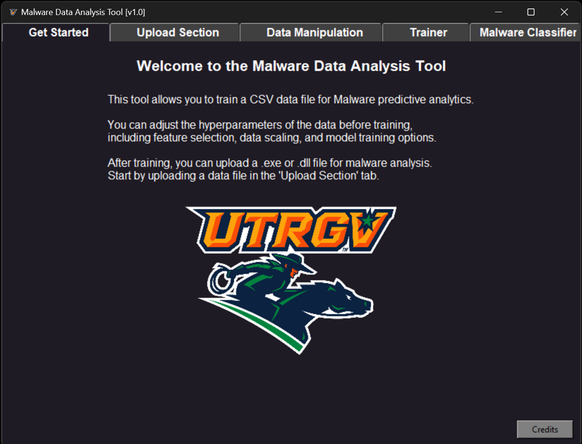

## [Project 1: PEAnalyzer - Malware Classification with Python & Tkinter](URL)

This project represents the culmination of my academic endeavors in CYBI 4336 - Cyber Security Engineering with Artificial Intelligence and Machine Learning, a course offered at The University of Texas Rio Grande Valley. Completed in the Fall 2023 semester, this final project showcases my comprehensive understanding of the subject matter and my ability to apply theoretical concepts to real-world challenges in the field of cyber security

### Overview

PEAnalyzer is a user-friendly malware analysis tool designed to empower security professionals and researchers.  Built with Python and a Tkinter GUI, it facilitates the extraction of features from Portable Executable (PE) files, the training of machine learning models, and the classification of unknown files as malware or benign.

### Key Features

### Data Handling:
* Load and process malware datasets from CSV files.
* Data preparation with feature selection and scaling (StandardScaler, RobustScaler).
* PE Feature Extraction: Calculate informative file statistics such as entropy, section sizes, and more using the pefile library.
  
### Machine Learning Integration:
* Train Support Vector Machine (SVM) or Random Forest Trees (RFT) classifiers with customizable parameters or utilize grid search optimization.
* Employ Random Forest for robust malware detection.
  
### Intuitive GUI:
* Conveniently upload and analyze PE files.
* Visualize results with a Seaborn confusion matrix.
* User-friendly interface with dark mode and hover effects.
* Error Handling & Utility: Robust exception handling and helper functions for a smooth user experience.
  
### Target Audience

Cybersecurity analysts seeking to improve malware detection.
Researchers exploring malware characteristics and classification techniques.
Students learning about practical malware analysis and machine learning.

### Benefits
Streamlines the malware analysis workflow.
Provides insights into PE file characteristics.
Offers a flexible platform with customizable machine learning models.

### Pictures

